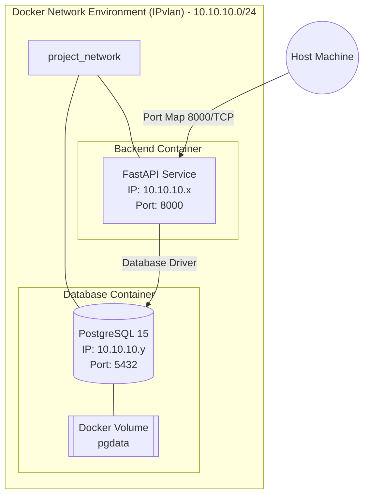
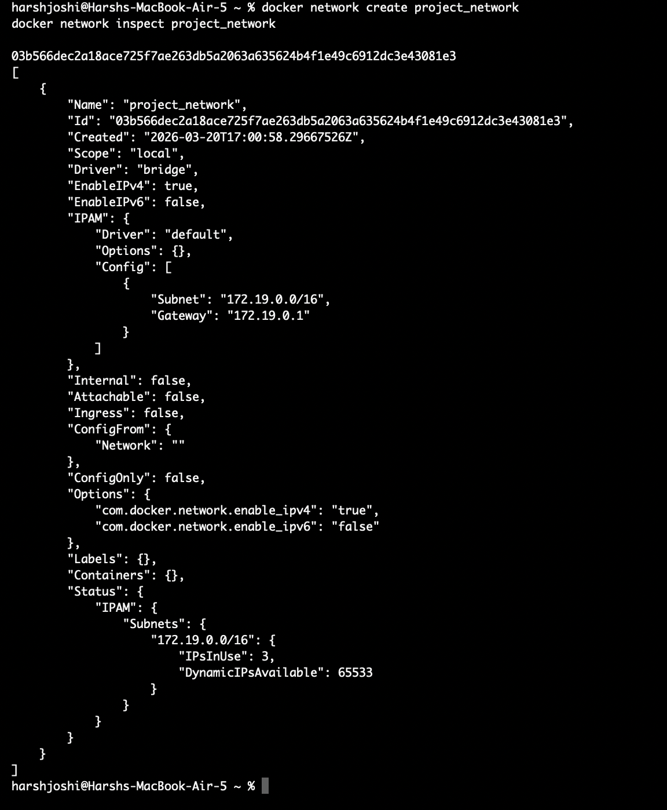
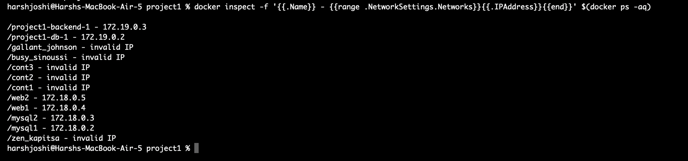
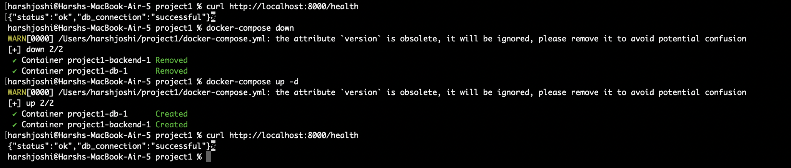

# 📦 Containerized Web Application with PostgreSQL

## 🏗️ System Architecture & Report
In an enterprise-grade environment, preventing bloated container images is crucial for deployment speed and security footprint. In this project, we implemented a **Multi-Stage Dockerfile** for the compiled Python environment to minimize the image footprint. 

- **Stage 1 (Builder):** Uses `python:3.11-slim`, installs heavy build dependencies (gcc, python3-dev), and builds python package wheels. We exclude these from the final runtime.
- **Stage 2 (Production):** The target stage adopts a pristine `python:3.11-slim`. It merely copies the generated `.whl` files from the Builder stage.

### Network Architecture
Here is how traffic flows inside the `project_network` IPvlan:


## 🔍 Network Inspection
First we created and inspected our custom IPvlan network (or Bridge on macOS):
```bash
docker network create project_network
docker network inspect project_network
```


## 🐳 Running Containers
Next, we brought up the database and backend using Docker Compose and fetched their assigned IP addresses inside the secure network mapping:
```bash
docker-compose up -d --build
docker inspect -f '{{.Name}} - {{range .NetworkSettings.Networks}}{{.IPAddress}}{{end}}' $(docker ps -aq)
```


## 💾 Volume Persistence Testing
Finally, we tested the API, shut down the containers (`docker-compose down`), booted them back up (`docker-compose up -d`), and hit the API again to prove the PostgreSQL volume successfully persisted our data!
```bash
curl http://localhost:8000/health
```


## 📊 Image Size Comparison
- **Baseline Monolithic Build (`python:3.11` without optimization):** The underlying full Python container starts at around 900+ MB before any code is even copied. 
- **Our Multi-stage Build:** Our dual-stage pattern yields an image that hovers under 130 MB total. This marks approximately an **85% reduction in size**.

## 🌐 Macvlan vs IPvlan
- **Macvlan** creates distinct MAC addresses for every container spun up. Unfortunately, many physical routers or macOS Wi-Fi adapters actively restrict MAC spoofing, blocking the traffic entirely.
- **IPvlan** shares the parent host’s MAC address but hands out unique IP addresses. It overcomes strict switch security restrictions, making it significantly more scalable and reliable in constrained topologies like ours.
