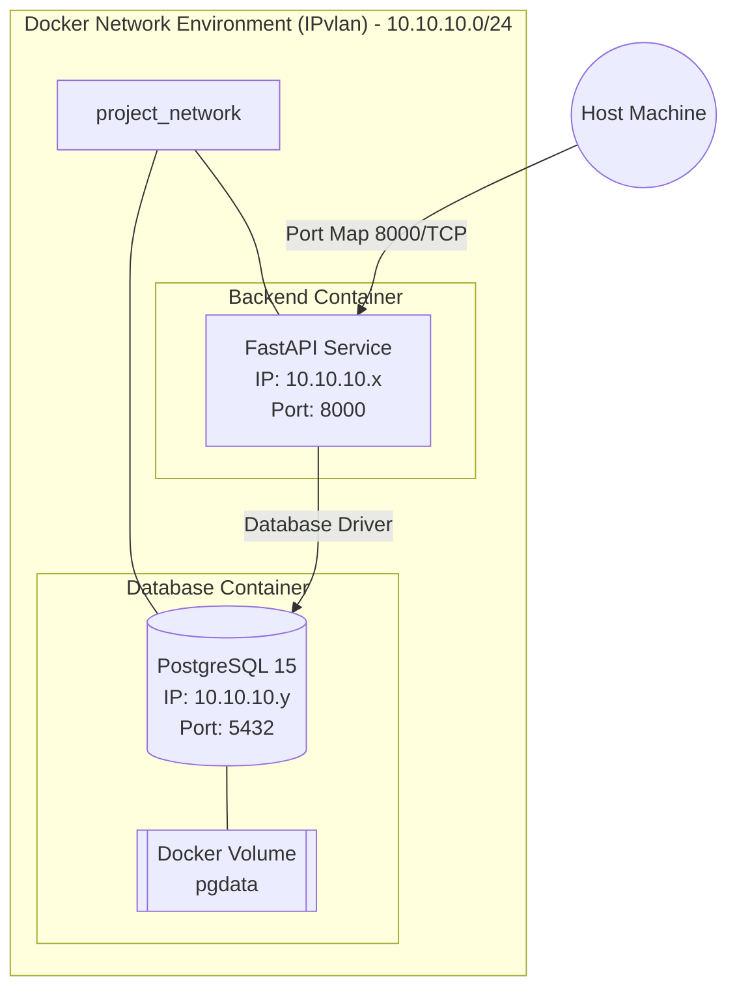

# Project Report: Containerized Web Application

## 1. Build Optimization Explanation
In a production-ready environment, preventing bloated container images is crucial for deployment speed, footprint, and security. In this project, we implemented a **Multi-Stage Dockerfile** for the compiled Python environment to minimize the image footprint. 

- **Stage 1 (Builder):** Uses the `python:3.11-slim` base image, but installs heavy build dependencies (e.g., `gcc`, `python3-dev`) via `apt-get` to construct python package wheels using `pip wheel` into a designated folder. Since these compilation tools are large and are vectors for security vulnerabilities if exposed, we successfully exclude them from our runtime.
- **Stage 2 (Production):** The target stage adopts a pristine `python:3.11-slim` base. Instead of installing compile utilities, it essentially copies the generated `.whl` files from the Builder stage and invokes `pip install --no-cache`. The application source code (`main.py`) is directly copied, culminating in a lightweight, self-contained execution environment void of extraneous shell tools or artifacts.

This methodology routinely trims hundreds of megabytes of unwanted operating-system packages out of the final layer, improving network transfer rates and reducing the potential attack surface.

## 2. Network Design Diagram
Below is the architectural mapping representing the network inter-connections.

## 3. Image Size Comparison
When observing standard vs. multi-stage Docker builds, the footprint divergence is striking:
- **Baseline Monolithic Build (`python:3.11` without optimization):** The initial `ubuntu`-based full Python container starts at around 900+ MB before any code is copied. Including compilation libraries spikes it towards 1GB+. 
- **Multi-stage with Slim:** Our dual-stage pattern yields an image that hovers under 130-150 MB total. The only footprint retained involves the required C-Python libraries, required dependencies (like `asyncpg`, `fastapi`), and the runtime application itself. The resulting comparison marks approximately an 85% reduction in size. This immense savings translates to decreased EC2/VPS storage charges, lowered pull time, and higher resilience to orchestration failures over time.

## 4. Macvlan vs IPvlan Comparison
Advanced container orchestration relies heavily on isolated network topologies to bridge connectivity accurately into physical or virtual subnets. When deciding between `Macvlan` versus `IPvlan`, it directly controls how MAC addresses are mapped and routed.

### Macvlan
- **Mechanism:** Creates distinct MAC addresses for every container spun up. From the perspective of the network switch, each container looks like an independent physical NIC. 
- **Key Modes:** *Bridge* (containers can communicate with each other alongside external nodes) and *802.1q Trunking*.
- **Challenges:** Many physical routers or virtualization platforms heavily restrict the number of MAC addresses a single host port can broadcast (locking it out for security or promiscuous mode policies). For instance, macOS' underlying Wi-Fi implementation actively prevents MAC spoofing entirely, rendering `Macvlan` unusable locally without VMs or Ethernet bridging. AWS also inherently restricts multiple MACs on a single ENI.

### IPvlan
- **Mechanism:** Shares the parent host’s MAC address. Containers are assigned unique IP addresses on the network logic, but functionally reuse the host interface's hardware MAC. 
- **Key Modes:** 
  - *L2 Mode:* Functions similarly to Macvlan; routing is resolved relying on ARP, but without generating unique MAC addresses.
  - *L3 Mode:* Forwards traffic solely on IP logic (acts as a mini router without L2 broadcast capability).
- **Advantages:** Overcomes strict switch security restrictions, VMware vSwitch MAC security parameters, or wireless adapters that drop unauthorized MAC addresses. It’s significantly more scalable in constrained topology environments since it won’t deplete the switch's MAC address tables. Because of macOS/AWS behavior constraints, IPvlan serves as the fundamentally more reliable and robust model when scaling horizontally.
